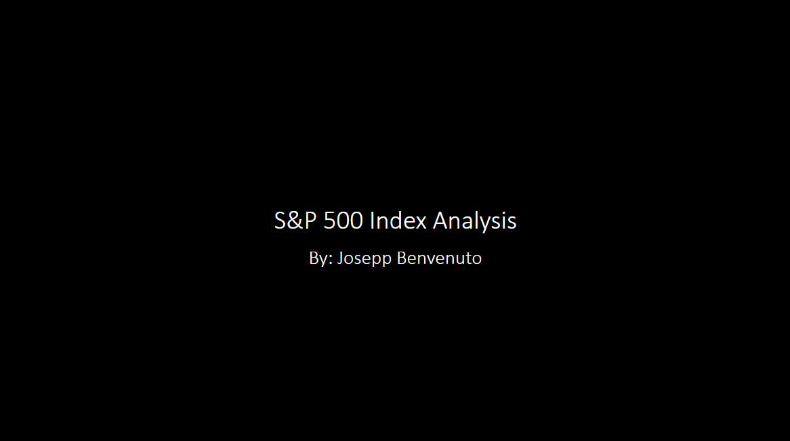

# S&P 500 Financial Analysis

## Project Description

analysis will explore the S&P 500 Index's closing prices (url: https://ca.finance.yahoo.com) within a four-decade time frame. The objective is to analyze the index and determine if the index is a valuable long-term investment.

Four decades:

Decade 1: 1979 - 1989 
Decade 2: 1989 - 1999 
Decade 3: 1999 - 2009 
Decade 4: 2009 - 2019 

The analysis will seek to understand the compounded returns (not including dividends) the index has produced within the above time frames. 

A/B tests will be used to infer if the difference in means of the S&P 500 Index closing prices between decades is statistically significant. The goal is to observe if the closing prices are higher or lower between the time frames and determine the investment risk. 

If the prices are higher in each new decade and statistically significant, intuitively, this will be determined to be a positive sign and that the index is producing profits; the opposite is true for the opposite results.

In addition to the above, the analysis will observe other macro and micro economic data trends regarding real U.S GDP (url: https://apps.bea.gov/api/_pdf/bea_web_service_api_user_guide.pdf), S&P 500 Index earnings per share (EPS) (url: https://ca.finance.yahoo.com), average U.S 10-year bond yields (url: https://www.treasury.gov/resource-center/data-chart-center/interest-rates/Pages/TextView.aspx?data=yield), and average annual U.S inflation rates (url: https://www.usinflationcalculator.com/inflation/historical-inflation-rates) to aid in the analysis.

The analysis can be taken advantage of by any individual or entity looking for a valuable investment opportunity.  

## Methods Used

1) Descriptive Statistics - used for preliminary data exploration.
2) Inferential Statistics - used to infer risk in the S&P 500 Index daily closing prices. 

## Predictions Dashboard

<strong>App User Name:</strong> data  <strong>App Password:</strong> analyst  <strong>Note -</strong> the dashboard takes a few seconds to load

* Deployed to Heroku here: https://nhl-dash-app.herokuapp.com/  

  

## Exploratory Dashboard

* Deployed to Heroku here: https://public.tableau.com/app/profile/josepp8009/viz/NHL_Stats_Dashboard/NHLStatsDashboard  

  

## Presentation Deck

* Deployed here: https://1drv.ms/p/s!Aq0DLMt0IS3zgn72EaqqBGdRCSvd?e=jfOE7U  

  

## NNHL Database Documentation Dashboard (open on desktop for macro functionality)

* Deployed here: https://1drv.ms/x/s!Aq0DLMt0IS3zgneW6LwCXfqNrkkY?e=h4iwKY  

  

## Technologies 

1) Python 
2) PostgreSQL
3) Jupyter Notebook
4) Tableau
5) Microsoft Excel
6) Microsoft PowerPoint

## Folder & Files & Descriptions

* **S&P_500_Analysis -**  An analysis of the S&P 500 Index as a long term investment.
  
  * **Data -** Stores the wrangled data to then be analyzed.
  * **Images -** Holds Jupyter Notebook Mark Down images.
  * **Preprocessing_Functions.py -** Stored functions used in the analysis.
  * **Stats_Functions.py -** Stored functions used in the analysis.
  * **S&P_500_Index_Analysis.ipynb -** An analysis in the S&P 500 Index as a long term investment

 

* **Regression_Analysis -**  Multiple Linear Regression analysis predicting season outcomes as described by adjusted wins a team won (wins + (ties / 2)) / mean adjusted wins.
  
  * **Data -** Stores the cleaned and wrangled data from the exploratory data analysis.
  * **Regression_Models -** Stores the Multiple Linear Regression algorithm and data scaling pipeline.
  * **Preprocessing_Functions.py -** Stored functions used in the analysis.
  * **Regression_Metrics_Functions.py -** Stored regression functions used in the analysis.
  * **NHL_1983_2021_Regression_EDA.ipynb -** Jupyter Notebook going through Exploratory data analysis before fitting the Multiple Linear Regression model.
  * **NHL_1983_2021_Multiple_Linear_Regression.ipynb -** Jupyter Notebook fitting and interpreting the Multiple Linear Regression model.

   
  
* **Classification_Analysis -**  Logistic Regression analysis predicting binary outcomes whether teams make or don't make the playoffs.
  
  * **Data -** Stores the cleaned and wrangled data from the exploratory data analysis.
  * **Classification_Models -** Stores the Logistic Regression algorithm and data scaling pipeline.
  * **Preprocessing_Functions.py -** Stored functions used in the analysis.
  * **Classification_Metrics_Functions.py -** Stored classification functions used in the analysis.
  * **NHL_1983_2021_Classification_EDA.ipynb -** Jupyter Notebook going through Exploratory data analysis before fitting the Logistic Regression model.
  * **NHL_1983_2021_Logistic_Regression.ipynb -** Jupyter Notebook fitting and interpreting the Logistic Regression model.

     
  
* **Dashboard -**  Stores all Plotly Dash app files. The Dashboard app allows the user to calculate NHL and season outcomes using the two algorithms produced in the analysis (regression and classification).

  * **Models -** Stores all the algorithms and scaling pipelines.
  * **Plotly_Dash_Season_Playoff_Dashboard.py -** Plotly Dash Dashboard app script.
