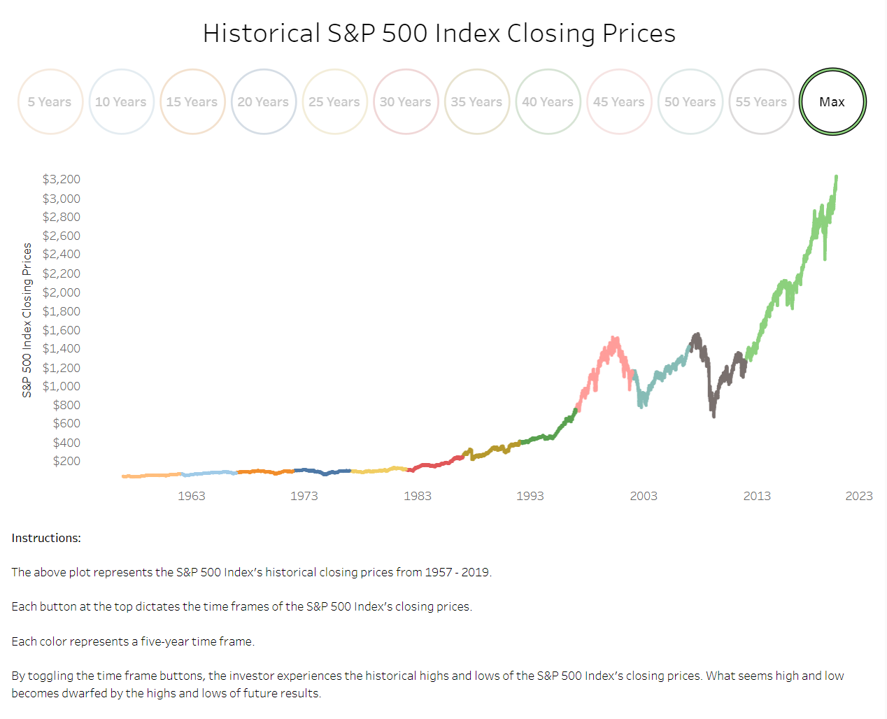

# S&P 500 Financial Analysis

## Project Description

analysis will explore the S&P 500 Index's closing prices (url: https://ca.finance.yahoo.com) within a four-decade time frame. The objective is to analyze the index and determine if the index is a valuable long-term investment.

Four decades:

Decade 1: 1979 - 1989 
Decade 2: 1989 - 1999 
Decade 3: 1999 - 2009 
Decade 4: 2009 - 2019 

The analysis will seek to understand the compounded returns (not including dividends) the index has produced within the above time frames. 

A/B tests will be used to infer if the difference in means of the S&P 500 Index closing prices between decades is statistically significant. The goal is to observe if the closing prices are higher or lower between the time frames and determine the investment risk. 

If the prices are higher in each new decade and statistically significant, intuitively, this will be determined to be a positive sign and that the index is producing profits; the opposite is true for the opposite results.

In addition to the above, the analysis will observe other macro and micro economic data trends regarding real U.S GDP (url: https://apps.bea.gov/api/_pdf/bea_web_service_api_user_guide.pdf), S&P 500 Index earnings per share (EPS) (url: https://ca.finance.yahoo.com), average U.S 10-year bond yields (url: https://www.treasury.gov/resource-center/data-chart-center/interest-rates/Pages/TextView.aspx?data=yield), and average annual U.S inflation rates (url: https://www.usinflationcalculator.com/inflation/historical-inflation-rates) to aid in the analysis.

The analysis can be taken advantage of by any individual or entity looking for a valuable investment opportunity.  

## Methods Used

1) Descriptive Statistics - used for preliminary data exploration.
2) Inferential Statistics - used to infer risk in the S&P 500 Index daily closing prices. 

## Financial Trends & Analysis Dashboard

<strong>App User Name:</strong> data  <strong>App Password:</strong> analyst  <strong>Note -</strong> the dashboard takes a few seconds to load

* Deployed to Heroku here: https://sp-500-fin-app.herokuapp.com/  

  

## Exploratory Dashboard

* Deployed to Heroku here: https://public.tableau.com/app/profile/josepp8009/viz/SP500Index_16105134799210/Dashboard  

  

## Presentation Deck

* Deployed here: https://1drv.ms/p/s!Aq0DLMt0IS3zgn-CDZfrzLUp4SJ6?e=VQfXJj  

  

## Financial DB Documentation Dashboard (open on desktop for macro functionality)

* Deployed here: https://1drv.ms/x/s!Aq0DLMt0IS3zgneW6LwCXfqNrkkY?e=h4iwKY  

  

## Technologies 

1) Python 
2) PostgreSQL
3) Jupyter Notebook
4) Tableau
5) Microsoft Excel
6) Microsoft PowerPoint

## Folder & Files & Descriptions

* **S&P_500_Analysis -**  An analysis of the S&P 500 Index as a long-term investment.
  
  * **Data -** Stores the wrangled data to then be analyzed.
  * **Images -** Holds Jupyter Notebook Mark Down images.
  * **Preprocessing_Functions.py -** Stored functions used in the analysis.
  * **Stats_Functions.py -** Stored functions used in the analysis.
  * **S&P_500_Index_Analysis.ipynb -** An analysis of the S&P 500 Index as a long-term investment

 

* **Financial_Statement_API_ETL_Pipeline -**  Wrangles public company financial statement data from https://site.financialmodelingprep.com/developer/docs API and passes the data through an ETL pipeline to be stored in a PostgreSQL database called financialdb (For Plotly Dash dashboard app).
  
  * **Create_Tables_Financial_Statements.py -** Creates a database called financialdb with all needed tables. This file can also be run when the database needs to be rebooted and started from scratch.
  * **SQL_Queries_EDGAR.py -** A file that contains all the necessary SQL queries for the ETL process.
  * **API_Financial_Statements.py -** Warangles data from the financial statements  API and stores the data in a newly created folder in the Data folder as a CSV to be made ready to be inserted into financialdb.
  * **Data -** Holds the wrangled data in separate folders from the API.
  * **ETL_Financial_Statements.py -** Passes the wrangled API data through an ETL process to be stored in financialdb.
   * **All_modules.py -** An application that runs both the API_Financial_Statements.py and ETL_Financial_Statements.py modules.
  * **FINANCIALDB_Test.ipynb -** Jupyter Notebook that runs SQL queries to test financialdb after the data pipeline has been run.

   
  
* **Dashboard -**  Stores all Plotly Dash app files. The Dashboard app allows the user to view historical financial trends for publicly traded American companies with financial definitions, life stock data, company summaries, company balance sheets, income statements, cash-flow statements, and some educational videos from successful investors.
  
  * **Apps -** Stores the different pages that the Plotly Dash dashboard app has.
  * **Data -** Stores a Python script that, if run, will pull the financial_statement_view from financialdb as a CSV file to be used for the Financial Trends & Analysis Dashboard web app.
  * **App.py -** Plotly Dash dashboard app file.
  * **Index.py -** Plotly Dash dashboard app file.

   