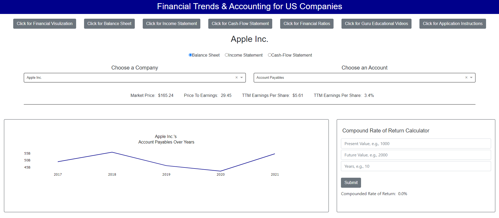

# NHL Linear & Logistic Regression Analysis

## Project Description

The analysis explored NHL team season data (url: https://www.kevinsidwar.com/iot/2017/7/1/the-undocumented-nhl-stats-api) from 1983 - 2021 to predict season and playoff outcomes (url: https://www.hockey-reference.com).

The season outcomes were calculated by how many adjusted wins a team won (wins + (ties / 2)) above the mean adjusted wins of any given season (season win deviation). The season outcome was calculated this way due to the varying nature of hockey; in some seasons, teams were closer regarding games won, and some had a more significant divide. In addition, some seasons were more extended than other seasons, and by using the adjusted games a team won **(wins + (ties / 2))** above or below the mean adjusted wins of any given season metric, all seasons were included in the analysis despite some seasons having fewer games played (shortened due to strike and pandemic).

More than 60% of teams make the playoffs, so the analysis set out to predict teams that did not make the playoffs.

The entirety of the analysis sought to understand the statistical economics of what NHL team organizations can focus on to reach the post-season. 

By understanding the economics of what holds teams back from making playoffs, teams can gain more transparency and perspective on what works with strategy and achieving successful campaigns in mind.

Achieving successful campaigns can potentially lead to increased revenue for all stakeholders through ticket sales, salary increases, endorsement deals, the fair book value of the organization, greater economic activity for the represented city, etc.  

## Methods Used

1) Descriptive Statistics - Used for preliminary data exploration.
2) Multiple Linear Regression - Predict season outcomes (adjusted wins a team won (wins + (ties / 2)) / mean adjusted wins).
3) Logistic Regression - Used predicted season outcomes to predict playoff outcomes.  

## Predictions Dashboard

<strong>App User Name:</strong> data  <strong>App Password:</strong> analyst  <strong>Note -</strong> the dashboard takes a few seconds to load

* Deployed to Heroku here: https://nhl-dash-app.herokuapp.com/  

  

## Exploratory Dashboard

* Deployed to Heroku here: https://public.tableau.com/app/profile/josepp8009/viz/NHL_Stats_Dashboard/NHLStatsDashboard  

  

## Presentation Deck

* Deployed here: https://1drv.ms/p/s!Aq0DLMt0IS3zgn72EaqqBGdRCSvd?e=jfOE7U  

  

## NNHL Database Documentation Dashboard (open on desktop for macro functionality)

* Deployed here: https://1drv.ms/x/s!Aq0DLMt0IS3zgneW6LwCXfqNrkkY?e=h4iwKY  

  

## Technologies 

1) Python 
2) PostgreSQL
3) Jupyter Notebook
4) Tableau
5) Microsoft Excel
6) Microsoft PowerPoint

## Folder & Files & Descriptions

* **API_Web_Scraping_ETL_Pipeline -**  Scarpes data from the web and the NHL API to be put through an ETL process and stored in a PostgreSQL database.
  
  * **Data -** Stores the wrangled data to then be put through an ETL process.
  * **Create_Tables_NHL.py -** Creates a database called nhldb wtih all needed tables. This file can also be run when the database needs to be rebooted and started from scratch.
  * **SQL_Queries_NHL.py -** A file that contains all the necessary SQL queries for the ETL process.
  * **API_Web_Scraper_NHL.py -** Webscrapes NHL playoff results (teams that made or didn't make the playoffs) from https://www.hockey-reference.com/ and pulls data from the NHL's API https://www.kevinsidwar.com/iot/2017/7/1/the-undocumented-nhl-stats-api.
  * **ETL_NHL.py -** Uses the data scraped from the web and pulled from the NHL API stored in the Data folder as CSV files to be processed through the ETL pipeline and stored in PostgreSQL and 2nd normal form.
  * **All_Modules.py -** Run this for all data pulls and ETL processes. The user will be prompted with questions and needs to respond when prompted. Data validation is in place.
  * **NHLDB_Test.ipynb -** Jupyter Notebook that runs SQL queries to test nhldb after the data pipeline has been run.

 

* **Regression_Analysis -**  Multiple Linear Regression analysis predicting season outcomes as described by adjusted wins a team won (wins + (ties / 2)) / mean adjusted wins.
  
  * **Data -** Stores the cleaned and wrangled data from the exploratory data analysis.
  * **Regression_Models -** Stores the Multiple Linear Regression algorithm and data scaling pipeline.
  * **Preprocessing_Functions.py -** Stored functions used in the analysis.
  * **Regression_Metrics_Functions.py -** Stored regression functions used in the analysis.
  * **NHL_1983_2021_Regression_EDA.ipynb -** Jupyter Notebook going through Exploratory data analysis before fitting the Multiple Linear Regression model.
  * **NHL_1983_2021_Multiple_Linear_Regression.ipynb -** Jupyter Notebook fitting and interpreting the Multiple Linear Regression model.

   
  
* **Classification_Analysis -**  Logistic Regression analysis predicting binary outcomes whether teams make or don't make the playoffs.
  
  * **Data -** Stores the cleaned and wrangled data from the exploratory data analysis.
  * **Classification_Models -** Stores the Logistic Regression algorithm and data scaling pipeline.
  * **Preprocessing_Functions.py -** Stored functions used in the analysis.
  * **Classification_Metrics_Functions.py -** Stored classification functions used in the analysis.
  * **NHL_1983_2021_Classification_EDA.ipynb -** Jupyter Notebook going through Exploratory data analysis before fitting the Logistic Regression model.
  * **NHL_1983_2021_Logistic_Regression.ipynb -** Jupyter Notebook fitting and interpreting the Logistic Regression model.

     
  
* **Dashboard -**  Stores all Plotly Dash app files. The Dashboard app allows the user to calculate NHL and season outcomes using the two algorithms produced in the analysis (regression and classification).

  * **Models -** Stores all the algorithms and scaling pipelines.
  * **Plotly_Dash_Season_Playoff_Dashboard.py -** Plotly Dash Dashboard app script.